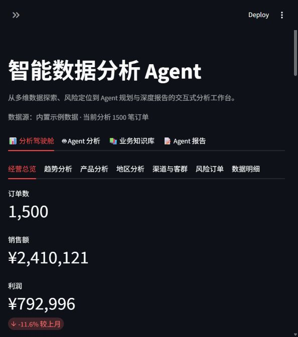
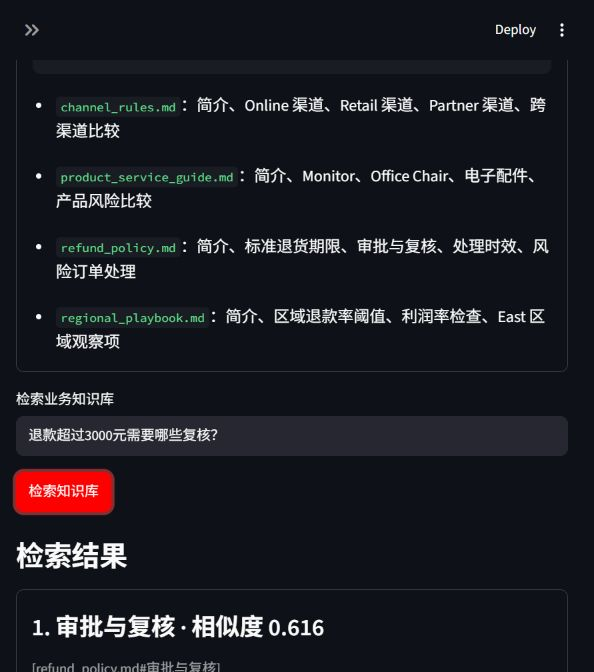
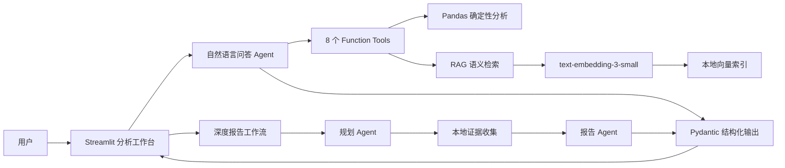

# 智能销售数据分析 Agent

[中文](README.md) | [English](README_EN.md)

一个面向真实业务分析场景的 Agent 工程项目：大语言模型负责理解目标与选择工具，Python 负责可靠计算，RAG 提供业务知识依据，多阶段工作流生成结构化深度报告。

**在线演示：** [打开 Streamlit 应用](https://data-insight-agent-cnug7q9cwxp93rjgis9pgm.streamlit.app/)

> 项目数据、政策和业务规则均为可复现的虚构演示资料，不代表任何真实公司。

## 项目亮点

- **可靠工具调用**：8 个分析与知识检索工具，避免模型直接心算或编造数字。
- **混合数据问答**：同时支持 Pandas 结构化数据分析和 Embedding RAG 文档检索。
- **多阶段工作流**：规划 Agent 选择分析模块，本地代码收集证据，报告 Agent 基于证据写作。
- **可观测性**：网页展示工具名称、参数、返回值、工作流计划和证据模块。
- **能力边界**：结构化输出明确区分正常回答与无法可靠回答的问题。
- **质量保障**：34 项离线测试与 8 个真实 Agent 回归用例全部通过。
- **完整产品界面**：筛选器、多维图表、风险订单、自动洞察、RAG 检索和报告下载。

## 页面演示

### 多维分析驾驶舱



### RAG 业务知识检索



## 系统架构



详细设计见 [架构说明](docs/ARCHITECTURE.md)。

## 用户能做什么

| 场景 | 示例 | 系统行为 |
|---|---|---|
| 精确数据查询 | 哪个地区利润率最低？ | 调用地区分析工具并引用真实计算结果 |
| 风险定位 | 最需要关注哪笔退款订单？ | 排序退款和负利润订单，返回具体订单依据 |
| 政策检索 | 超过 3,000 元退款需要谁复核？ | RAG 检索政策章节并返回来源引用 |
| 混合问题 | East 退款率达到手册阈值了吗？ | 同时调用数据工具与 RAG，再综合回答 |
| 深度报告 | 分析渠道、趋势和退款风险 | 规划 → 证据收集 → 结构化报告 |
| 能力边界 | 预测下个月利润 | 明确说明缺少预测能力，不编造结果 |

## 技术栈

- **Agent**：OpenAI Agents SDK、Function Calling、Runner、执行追踪
- **模型**：`gpt-5.6-luna`
- **RAG**：`text-embedding-3-small`、Markdown Chunking、Cosine Similarity
- **数据分析**：Pandas、Matplotlib
- **结构化输出**：Pydantic
- **前端**：Streamlit
- **测试与评测**：unittest、Streamlit AppTest、自定义 Agent Evals
- **工程化**：dotenv、GitHub Actions、Streamlit Community Cloud 配置

## 关键设计决策

### 为什么不让模型直接计算数据？

销售额、利润率、排名等结果由 Pandas 工具计算，模型只负责选择工具和解释证据。这降低了数字错误与幻觉风险。

### 为什么同时使用工具调用和 RAG？

- CSV 中的总和、排名、趋势属于结构化计算问题，适合 Pandas。
- 政策、规则和操作手册属于非结构化知识，适合 RAG。
- Agent 负责判断该走哪条路径，并在混合问题中组合两类证据。

### 为什么报告拆成两个 Agent？

规划和写作是不同职责。规划 Agent 只选择必要模块；代码执行可验证的计算；报告 Agent 不能接触未收集的证据，从架构上限制无依据扩写。

## 数据与知识库

- `data/sales_large.csv`：固定随机种子生成的 1,500 条销售订单，覆盖 18 个月。
- `knowledge/`：4 份虚构业务文档，包括退款政策、区域手册、渠道规则和产品售后指南。
- `data/knowledge_index.json`：19 个知识块的预构建 Embedding 向量索引。

## 本地运行

要求 Python 3.11 或更高版本，推荐 Python 3.12。

```powershell
python -m venv .venv
.\.venv\Scripts\python.exe -m pip install -e .
Copy-Item .env.example .env
```

打开 `.env`，填入自己的 API Key：

```dotenv
OPENAI_API_KEY=your_api_key_here
```

启动网页：

```powershell
.\.venv\Scripts\python.exe -m streamlit run streamlit_app.py
```

浏览器访问 `http://localhost:8501`。

## 测试与评测

运行不消耗 API 额度的离线测试：

```powershell
.\.venv\Scripts\python.exe -m unittest discover -s tests -v
```

运行真实 Agent 回归评测，会产生少量 API 费用：

```powershell
.\.venv\Scripts\python.exe scripts\run_evals.py
```

当前基线：

| 验证类型 | 结果 | 检查内容 |
|---|---:|---|
| 离线测试 | 34 / 34 | 数据计算、API 错误分类、RAG、工作流、页面冒烟测试 |
| Agent Evals | 8 / 8 | 状态、工具选择、关键数字、RAG 引用、混合调用 |

## 辅助脚本

```powershell
# 重新生成 1,500 条样本数据
.\.venv\Scripts\python.exe scripts\generate_sample_data.py

# 知识文档变化后重建向量索引
.\.venv\Scripts\python.exe scripts\build_knowledge_index.py

# 运行 RAG 检索示例
.\.venv\Scripts\python.exe scripts\rag_demo.py

# 运行双 Agent 报告工作流
.\.venv\Scripts\python.exe scripts\report_demo.py

# 发送一次极小请求，检查 API 认证、额度和模型权限
.\.venv\Scripts\python.exe scripts\check_openai_access.py
```

## 项目结构

```text
agent/
├── data/                     # 示例销售数据与向量索引
├── evals/                    # Agent 回归评测用例
├── knowledge/                # RAG 业务知识文档
├── scripts/                  # 数据、索引、评测和报告脚本
├── src/data_agent/
│   ├── agent.py              # 问答 Agent 与 Function Tools
│   ├── analysis.py           # 基础确定性数据工具
│   ├── insights.py           # 多维指标、风险和自动洞察
│   ├── rag.py                # Chunk、Embedding、向量检索
│   ├── report_workflow.py    # 规划 Agent 与报告 Agent 工作流
│   └── evaluation.py         # Agent 行为评分器
├── tests/                    # 34 项离线测试
├── streamlit_app.py          # 交互式分析工作台
└── pyproject.toml            # 项目与依赖配置
```

## 当前限制与下一步

- 知识库规模较小，目前使用本地 JSON 向量索引；更大规模可迁移至 pgvector、Milvus 或托管向量数据库。
- 数据文件仍是 CSV；生产环境可接入数据库并增加权限控制。
- 自动洞察是描述性分析，不进行因果推断或未来预测。
- 可进一步使用 LangGraph 增加持久化状态、失败重试和人工审批节点。
