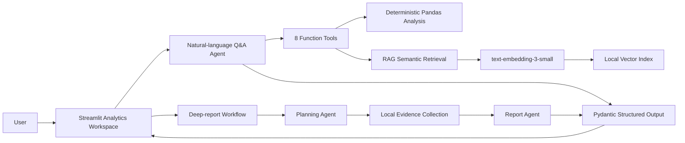

# Intelligent Sales Data Analysis Agent

[中文](README.md) | [English](README_EN.md)

An end-to-end agent engineering project for realistic business analysis. The LLM understands user intent and selects tools, deterministic Python code performs reliable calculations, RAG retrieves business knowledge, and a multi-stage workflow produces evidence-grounded reports.

**Live demo:** [Open the Streamlit app](https://data-insight-agent-cnug7q9cwxp93rjgis9pgm.streamlit.app/)

> The interface is currently in Chinese. All datasets, policies, and business rules are reproducible synthetic examples and do not represent a real company.

## Highlights

- **Reliable tool use:** eight analysis and retrieval tools prevent the model from inventing or mentally calculating business metrics.
- **Hybrid question answering:** combines structured Pandas analysis with embedding-based RAG over unstructured documents.
- **Multi-agent workflow:** a planning agent selects analysis modules, local code gathers evidence, and a report agent writes only from that evidence.
- **Observable execution:** the UI exposes tool names, arguments, outputs, workflow plans, and evidence modules.
- **Explicit capability boundaries:** Pydantic outputs distinguish supported answers from requests the system cannot answer reliably.
- **Quality assurance:** 34 offline tests and eight live agent regression evaluations pass the current baseline.
- **Product-style interface:** interactive filters, multidimensional charts, risk orders, automated insights, RAG search, and downloadable reports.

## Demo

### Multidimensional analytics cockpit


### RAG business knowledge search


## Architecture



See [the architecture notes](docs/ARCHITECTURE.md) for the detailed design.

## What Users Can Do

| Scenario | Example | System behavior |
|---|---|---|
| Exact metric query | Which region has the lowest profit margin? | Calls the regional analysis tool and cites computed results |
| Risk investigation | Which refund order needs the most attention? | Ranks refunded and loss-making orders and returns supporting records |
| Policy retrieval | Who must review refunds above CNY 3,000? | Retrieves the relevant policy section with a source citation |
| Hybrid question | Has East reached the manual's refund-risk threshold? | Combines a data tool with RAG evidence before answering |
| Deep report | Analyze channel, trend, and refund risks | Plans modules, gathers evidence, and produces a structured report |
| Capability boundary | Predict next month's profit | States that forecasting is unsupported instead of fabricating a result |

## Tech Stack

- **Agent:** OpenAI Agents SDK, function calling, Runner, execution tracing
- **Model:** `gpt-5.6-luna`
- **RAG:** `text-embedding-3-small`, Markdown chunking, cosine similarity
- **Data analysis:** Pandas, Matplotlib
- **Structured outputs:** Pydantic
- **Frontend:** Streamlit
- **Testing and evaluation:** unittest, Streamlit AppTest, custom agent evals
- **Engineering:** dotenv, GitHub Actions, Streamlit Community Cloud

## Key Design Decisions

### Why not let the model calculate metrics directly?

Pandas tools calculate revenue, margin, rankings, and other numerical results. The model only selects tools and explains returned evidence, reducing arithmetic errors and hallucinations.

### Why combine tool calling with RAG?

- Aggregations, rankings, and trends in CSV data require deterministic structured computation.
- Policies, rules, and operating manuals are unstructured knowledge suited to RAG.
- The agent routes each request to the appropriate path and combines both evidence types for hybrid questions.

### Why split report generation across two agents?

Planning and writing have different responsibilities. The planning agent selects only the necessary modules, local code performs verifiable calculations, and the report agent cannot access evidence that was not collected. This constrains unsupported elaboration by design.

## Data and Knowledge Base

- `data/sales_large.csv`: 1,500 synthetic orders across 18 months, generated with a fixed random seed.
- `knowledge/`: four synthetic business documents covering refund policy, regional operations, channel rules, and product support.
- `data/knowledge_index.json`: a prebuilt local vector index containing 19 knowledge chunks.

## Run Locally

Python 3.11 or newer is required; Python 3.12 is recommended.

```powershell
python -m venv .venv
.\.venv\Scripts\python.exe -m pip install -e .
Copy-Item .env.example .env
```

Add your API key to `.env`:

```dotenv
OPENAI_API_KEY=your_api_key_here
```

Start the application:

```powershell
.\.venv\Scripts\python.exe -m streamlit run streamlit_app.py
```

Open `http://localhost:8501` in a browser.

## Tests and Evaluations

Run the offline suite without consuming API credits:

```powershell
.\.venv\Scripts\python.exe -m unittest discover -s tests -v
```

Run live agent regression evaluations, which consume a small amount of API credit:

```powershell
.\.venv\Scripts\python.exe scripts\run_evals.py
```

Current baseline:

| Validation | Result | Coverage |
|---|---:|---|
| Offline tests | 34 / 34 | Calculations, API error classification, RAG, workflows, and UI smoke tests |
| Agent evals | 8 / 8 | Status, tool routing, key figures, RAG citations, and hybrid tool use |

## Utility Scripts

```powershell
# Regenerate the 1,500-order sample dataset
.\.venv\Scripts\python.exe scripts\generate_sample_data.py

# Rebuild the vector index after changing knowledge documents
.\.venv\Scripts\python.exe scripts\build_knowledge_index.py

# Run a RAG retrieval example
.\.venv\Scripts\python.exe scripts\rag_demo.py

# Run the two-agent reporting workflow
.\.venv\Scripts\python.exe scripts\report_demo.py

# Verify API authentication, quota, and model access with one tiny request
.\.venv\Scripts\python.exe scripts\check_openai_access.py
```

## Project Structure

```text
agent/
├── data/                     # Sample sales data and vector index
├── evals/                    # Agent regression evaluation cases
├── knowledge/                # RAG business knowledge documents
├── scripts/                  # Data, indexing, evaluation, and demo scripts
├── src/data_agent/
│   ├── agent.py              # Q&A agent and function tools
│   ├── analysis.py           # Deterministic core calculations
│   ├── insights.py           # Multidimensional metrics, risks, and insights
│   ├── rag.py                # Chunking, embeddings, and vector retrieval
│   ├── report_workflow.py    # Planning and report-writing agents
│   ├── api_errors.py         # Safe, actionable API error classification
│   └── evaluation.py         # Agent behavior evaluator
├── tests/                    # 34 offline tests
├── streamlit_app.py          # Interactive analytics workspace
└── pyproject.toml            # Package and dependency configuration
```


## Current Limitations and Next Steps

- The knowledge base is intentionally small and uses a local JSON vector index; a larger deployment could use pgvector, Milvus, or a managed vector database.
- Data is currently loaded from CSV; a production system would integrate a database and authorization controls.
- Automated insights are descriptive and do not claim causal relationships or forecast future performance.
- LangGraph could add persistent state, retry policies, and human-approval nodes for more complex workflows.
