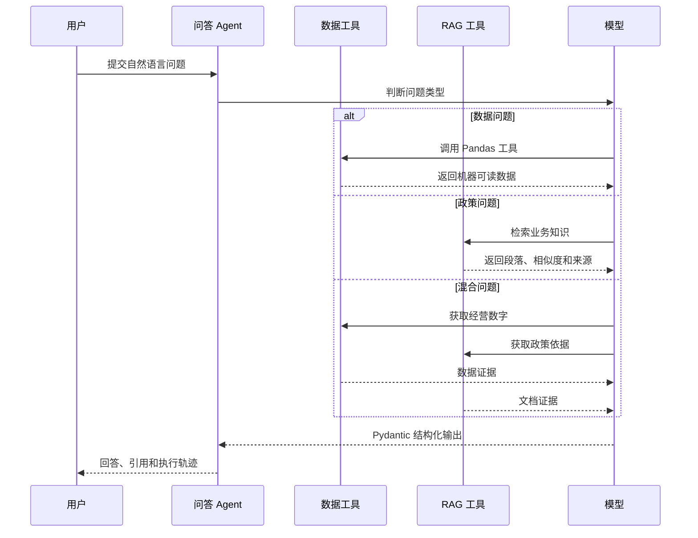
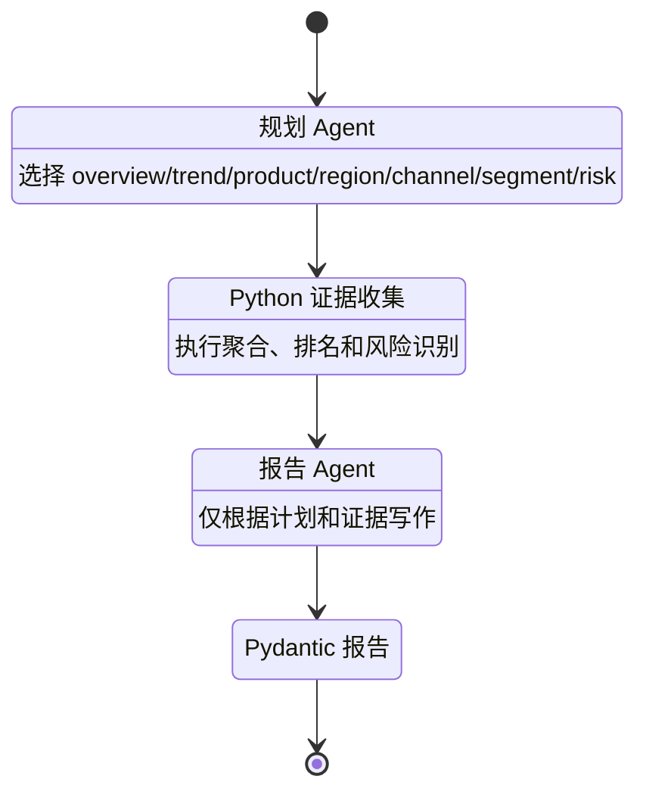

# 系统架构说明

## 设计目标

这个项目不是让大模型直接读取 CSV 后自由回答，而是把任务拆成可验证的模块：

- 模型负责理解问题、选择路径和组织语言。
- Python 负责计算、聚合、排序和校验。
- RAG 负责从业务文档中检索相关规则。
- Pydantic 负责约束 Agent 输出结构。
- Evals 负责检查工具选择、状态和关键事实。

## 自然语言问答流程



## RAG 数据流

### 离线索引阶段

```text
Markdown 文档
  → 按二级标题切分 Chunk
  → text-embedding-3-small 批量向量化
  → 保存为 data/knowledge_index.json
```

### 在线检索阶段

```text
用户问题
  → 生成问题向量
  → 与本地 19 个知识块计算余弦相似度
  → 返回 Top 4 段落
  → Agent 保留 [source#section] 引用
```

文档索引只在内容发生变化时重建。普通查询只向 Embedding API 发送当前问题，文档向量在本地复用。

## 深度报告工作流



这种拆分让每个阶段职责单一，也方便单独测试和观察失败位置。

## 状态管理

- 多轮问答保存模型可重放的对话历史。
- 页面保存用户可见的聊天记录和工具轨迹。
- 数据源或筛选条件变化后自动清空旧对话和旧报告。
- 每次 Agent 运行限制最大轮次，避免无限工具循环。

## 质量保障

### 离线测试

- CSV 字段校验和派生字段计算
- 产品、月份、地区、渠道与客群聚合
- 风险订单排序和数量限制
- Markdown 分块与向量相似度
- 报告证据收集和 Markdown 导出
- Streamlit 页面冒烟测试

### Agent 回归评测

评测器检查三个可观察信号：

1. `status` 是否为 `answered` 或 `unsupported`。
2. 实际工具集合是否符合预期。
3. 最终回答是否包含必要数字、政策内容和来源。

## 安全与边界

- API Key 只从环境变量或 Streamlit Secrets 读取。
- `.env` 与 `.streamlit/secrets.toml` 均被 Git 忽略。
- Agent 不执行预测或因果推断。
- RAG 文档明确标注为虚构演示规则。
- 上传新数据后，旧对话状态不会继续复用。
